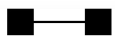

# RDB Data Modeling
>생활코딩 강의를 보고 요약 정리하였다. 

 

## 관계형 데이터 모델링의 전체 흐름
업무파악 &rarr; 개념적 데이터 모델링 &rarr; 논리적 데이터 모델링 &rarr; 물리적 데이터 모델링

 

## 업무파악
프로젝트 프로토타이핑 툴
* https://ovenapp.io/

 

## 개념적 데이터 모델링
### 개념적 데이터 모델링 소개
파악한 업무에서 개념을 뽑아내는 과정.
* 개념적 데이터 모델링은 현실에서 개념을 추출하는 필터를 제공한다. 
* 또한 개념에 대해서 다른 사람들과 대화하게 해주는 언어로서 작용하게 해준다. 
* 이런 목적을 이루게 해주는 도구가 ERD (Entity Relationship Diagram)이다.
>ERD는 현실을 세 개의 관점을 바라볼 수 있는 파인더를 제공해준다.
>* 정보
>* 그룹
>* 관계
### 관계형 데이터베이스 다운 개념의 구조
* RDB는 내포관계를 허용하지 않는다. 
* 평면적인 관계로 개념을 뽑아낸다.
* 거대 단일 테이블로 표현을 하면 중복이 발생한다.
* 주제에 따라서 데이터를 그룹핑할 수 있다. 
* 원하는 주제만으로 뽑아낼 수 있고, 원한다면 조인을 통해서 원하는 구성만을 가져올 수 있다. 따라서, 컴퓨터의 자원을 아낄 수 있다. 
### ERD의 구성요소
* 찾아낸 개념을 개념적 모델링 또는 ERD에선 Entity라고 한다.
이 Entity는 테이블로 전환되게 된다.
* 구체적인 것(제목, 본문, 생성일)들을 그룹핑한 것을 Entity(글)이다. 
* 구체적인 데이터를 Attribute(속성)이라고 부른다. 후에 테이블의 컬럼이 된다.
* Entity 간에 연관성을 표현하는 것을 Relation(관계)라고 하고, 테이블에서는 pk,fk 형태로 표현되게 된다. 또한 join을 통해서 동적으로 표현하게 된다.
> 참고 : Tuple -> row(행)
### ERD의 표현 방식
* 엔티티 &rarr; 사각형
* 속성 &rarr; 원
* 그룹핑 &rarr; 엔티티에 선으로 연결
* PK &rarr; 밑줄
* 관계 &rarr; 마름모꼴
### 식별자(identifier)
* 엔티티의 속성 중 식별자를 지정해야한다.(원하는 대상을 정확히 타겟팅하기 위해 중복이 없어야 한다. ) &rarr; PK
* 식별자가 될 수 있는 후보를 후보키(candidate key)라고 한다.
* 후보키 중에서 선택된 것을 기본키(primary key)
* 후보키 중에서 기본키가 아닌 것들을 대체키(alternate key) (나중에 성능 향상을 위해서 secondary index를 걸 수 있다.)
* 칼럼을 합쳐서 식별하는 것을 중복키(composite key)라고 부른다.
### Cardinality
1:1

1:N

N:M

### Optionality
>Ex : 저자는 댓글을 작성하지 않을 수도 있다. (저자에게 댓글은 옵션이다.)

### Mandatory
>Ex : 각 댓글은 반드시 저자가 있다. (댓글에게 저자는 필수이다.)

 

## 논리적 데이터 모델링
뽑아낸 개념을 관계형 데이터 패러다임에 어울리게 데이터 형식을 정리정돈
### Mapping rule
간단히 얘기하자면 
* Entity &rarr; Table
* Attribute &rarr; Column
* Relation &rarr; PK,FK
### N:M 관계의 처리
다대다 관계는 RDB에서 표현이 안되므로 매핑테이블(연결테이블)이 필요하다.
### Normalization(정규화)
정제되지 않은 데이터(표)를 관계형 데이터베이스에 어울리는 표로 만들어주는 레시피이다.

산업적으로 많이 사용되는 것은 제 3정규형이 많이 사용되고 그 이후의 것들은 학술적으로 많이 사용된다.
### 제 1 정규화 - Atomic columns
각 행,열의 값들이 원자적이여야 한다. (값을 하나만 가져라)
### 제 2 정규화 - No partial dependencies
테이블 상에 부분 종속성이 없어야 한다.
### 제 3 정규형 - No transitive dependencies
이행적 종속성이 없어야 한다.

 

## 물리적 데이터 모델링
이상적인 표를 구체적인 제품에 맞는 현실적인 표로 만드는 것. (성능을 고려)

성능을 향상시키위한 인덱스, 캐시 등등 시도하고 마지막에는 역정규화를 고려할 수 있다.
### 몇가지의 역정규화 
* 칼럼의 역정규화 - join 줄이기 : 칼럼 중복.
* 칼럼의 역정규화 - 계산작업을 줄이기 : 파생 칼럼의 형성.
* 테이블의 역정규화 - 컬럼을 기준으로 테이블을 분리.
* 테이블의 역정규화 - 행을 기준으로 테이블을 분리.
* 관계의 역정규화 - 지름길을 만든다.

